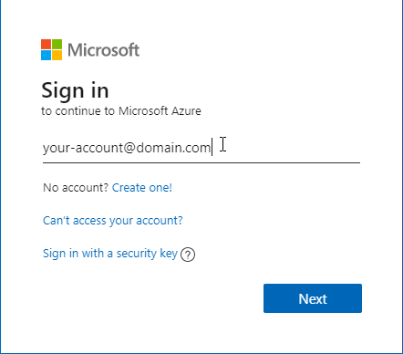
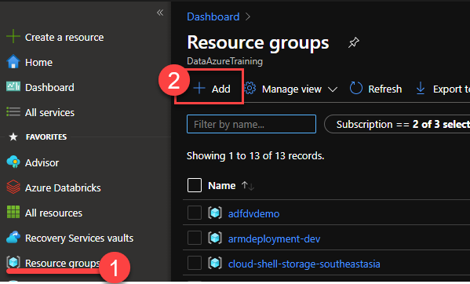
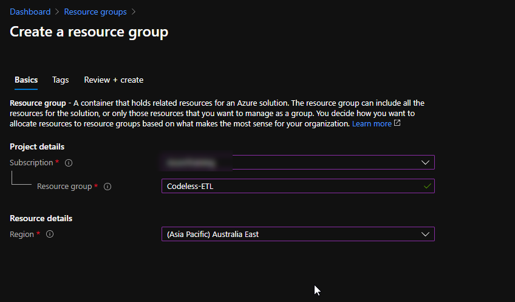

# Deploy Codeless-ETL demos to your subscription

In this section you will automatically provision all Azure resources used in the Codeless-ETL with Azure Data Factory presentation from the SQL Server User Group. We will use a pre-defined ARM template with the definition of all Azure services used to ingest, store, process and visualise data.

## Azure services provisioned for the demos
The following resources will be deployed in your subscription:

| Name               | Type | Pricing Tier | Pricing Info |
| ------------------ | ---- | ------------ | ------------ |
| Azure Data Factory |

  **IMPORTANT**: When you deploy the lab resources in your own subscription you are responsible for the charges related to the use of the services provisioned. If you don't want any extra charges associated with the lab resources you should delete the lab resource group and all resources in it.

 ## Prepare your Azure subscription
In this section you will use the Azure Portal to create a Resource Group that will host the Azure Data Services used in labs 1 through to 5.

**IMPORTANT**|
-------------|
**Execute these steps on your host computer**|

1.	Open the browser and navigate to https://portal.azure.com

    

2.	Log on to Azure using your account credentials

    

3.	Once you have successfully logged on, locate the **Favourites** menu on the left-hand side panel and click the **Resource groups** item to open the **Resource groups** blade.

4.	On the **Resource groups** blade, click the **+ Add** button to create a new resource group.

    

5.	On the **Create a resource group** blade, select your subscription in **Subscription** drop down list.

6.	In the Resource group text box enter “Codeless-Demo”

   **IMPORTANT**: The name of the resource group chosen is ***not*** relevant to the successful completion of the labs. If you choose to use a different name, then please proceed with the rest of the lab using your unique name for the resource group. 
   
    

7.	In the Region drop down list, select one of the regions from the list below.

    **IMPORTANT**: The ARM template you will use to deploy the lab components uses the Resource Group region as the default region for all services. To avoid deployment errors when services are not available in the region selected, please use one of the recommended regions in the list below.

    Recommended Regions |
    ------------------- |
    East US |
    South Central US |
    West US |
    Japan East |
    West Europe |
    UK South |
    Australia East |
    | 
    

8.	Proceed to create the resource group by clicking **Review + Create**, and then **Create**.

-------------------------------------

## Deploy Azure Services
In this section you will use automated deployment and ARM templates to automate the deployment of all Azure Data Services used in the demo.

1. You can deploy all Azure services required in each lab by clicking the **Deploy to Azure** button below.

 (https://portal.azure.com/#create/Microsoft.Template/uri/https%3A%2F%2Fgithub.com%2Fsandman153%2FCodeless-ETL%2Fblob%2Fmain%2FDeploy%2Fazuredeploy.json)

1. You will be directed to the Azure portal to deploy the ADPE2E ARM template from this repository. On the **Custom deployment** blade, enter the following details:
     - **Subscription**: [your Azure subscription]
     - **Resource group**: [select the resource group you created in the previous section]

    Please review the Terms and Conditions and check the box to indicate that you agree with them.

2. Click **Purchase**

4. Navigate to your resource group to monitor the progress of your ARM template deployment. A successful deployment should last less than 10 minutes.

    

5. Once your deployment is complete you are ready to start your labs. Enjoy!

    

## Demo cost management

The approximate cost to run the resources provisioned for the estimated duration of this workshop (2 days) is around USD 100.00. Remember that you will start get charged from the moment the resource template deployment completes successfully. You can minimise costs during the execution of the labs by taking the following actions below:

| Azure Resource     | Type               | Action                                     |
| ------------------ | ------------------ | ------------------------------------------ |
| Azure SQLDB        | Azure SQL DB       | Delete the resources when demo is complete |
| Azure Data Factory | Azure Data Factory | Stop Debugging once demo is complete       |

Some of the services still incur costs even when not running. If you don't want any extra charges associated with the lab resources you should delete the lab resource group and all resources in it.