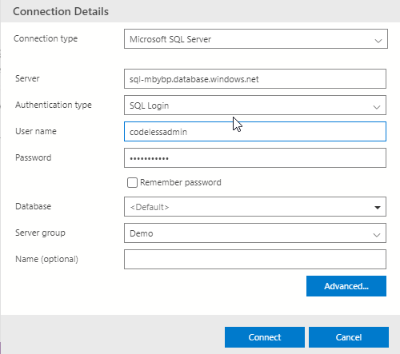
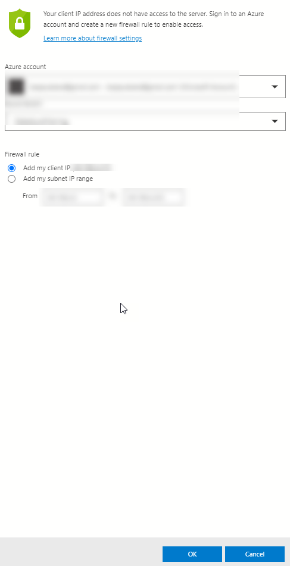
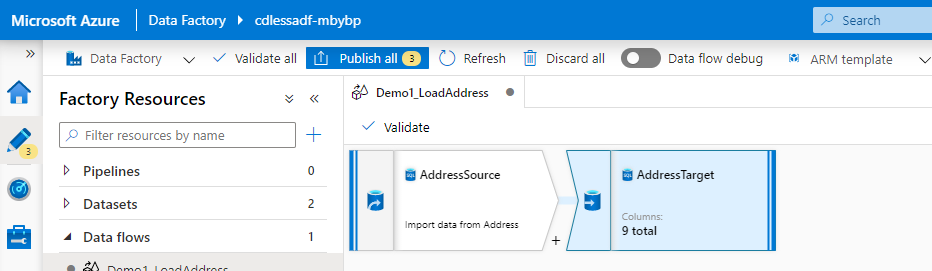
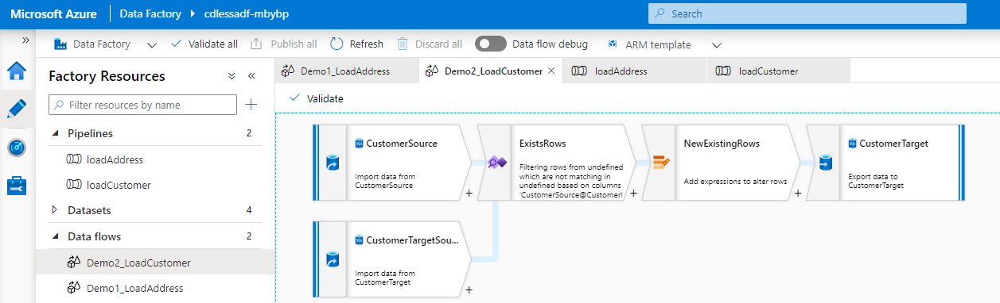

# Codeless-ETL
This demo is a brief introduction to Azure Data Factory and Mapping Data Flows. The intent of this demo is to show how codeless ETL works with Mapping dataflows  and how it enables development of complex code in a short amount of time.

The source data for this demo is the adventure works database and is available free from https://docs.microsoft.com/en-us/sql/samples/adventureworks-install-configure?view=sql-server-ver15&tabs=ssms

In this demo I will build pipelines using the AdventureWorks database and will be using two tables from that database.

## [Environment Setup: Deploy Codeless-ETL resources to your subscription](./Deploy/Deploy.md)


## 1. Simple Data Flow
For the first demo I will be coping data from a source table in the Adventure Works database to a target table in the Codeless-ETL database with no modifications

As a starting step connect to the Azure SQL DB created during the setup using Azure Data Studio. Install [Download and install Azure Data Studio](https://docs.microsoft.com/en-us/sql/azure-data-studio/download-azure-data-studio?view=sql-server-ver15) if it is not already installed.

Once it is installed connect to the Azure SQL DB created for the demo.



Add an entry to the firewall for your IP Address



Create a Table in the Codeless-Demo database using the following query.

```sql
    CREATE TABLE dbo.[Address](
	[AddressID] [int]  NULL,
	[AddressLine1] [nvarchar](60)  NULL,
	[AddressLine2] [nvarchar](60) NULL,
	[City] [nvarchar](30)  NULL,
	[StateProvince] varchar(255) NULL,
	[CountryRegion] varchar(255) NULL,
	[PostalCode] [nvarchar](15)  NULL,
	[rowguid] varchar(255)  NULL,
	[ModifiedDate] [datetime]  NULL
) ON [PRIMARY]
```

In Azure Data Factory create a mapping data flow and create a source and destination connection where the source connection points to the AdventureWorksLT database and the destination is the Codeless-Demo database

This demo creates a simple copy of data from source to target.



## 2. Insert Slowly changed records
In this section of the Demo I will create a more complex scenario where I build in an SCD scenario when loading data.

```sql
    CREATE TABLE [dbo].[Customer](
	[CustomerID] [int] NULL,
	[NameStyle] varchar(255) NULL,
	[Title] [nvarchar](8) NULL,
	[FirstName] varchar(255) NULL,
	[MiddleName] varchar(255) NULL,
	[LastName] varchar(255) NULL,
	[Suffix] [nvarchar](10) NULL,
	[CompanyName] [nvarchar](128) NULL,
	[SalesPerson] [nvarchar](256) NULL,
	[EmailAddress] [nvarchar](50) NULL,
	[Phone] varchar(255) NULL,
	[PasswordHash] [varchar](128) NULL,
	[PasswordSalt] [varchar](10) NULL,
	[rowguid] varchar(255) NULL,
	[ModifiedDate] [datetime] NULL
) ON [PRIMARY]
```

In Azure Data Factory create a mapping data flow and create a source and destination connection where the source connection points to the AdventureWorksLT database and the destination is the Codeless-Demo database

This inserts any new records only into the target table, but this code can be modified slightly to perform SCD type 2 loads.



T